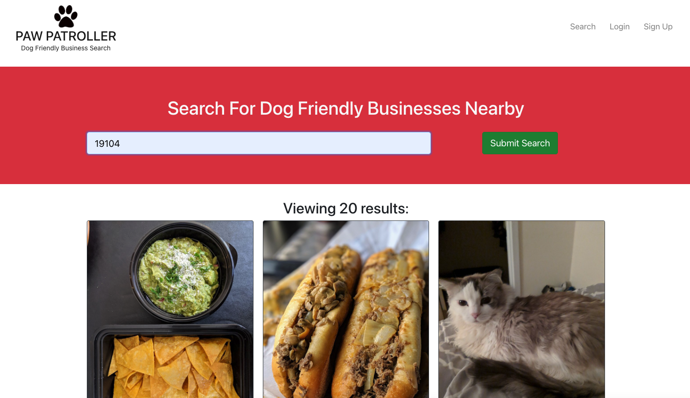
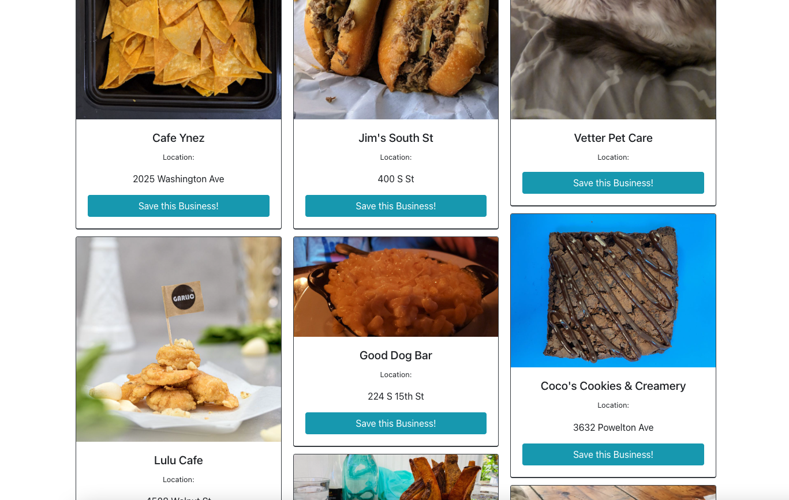
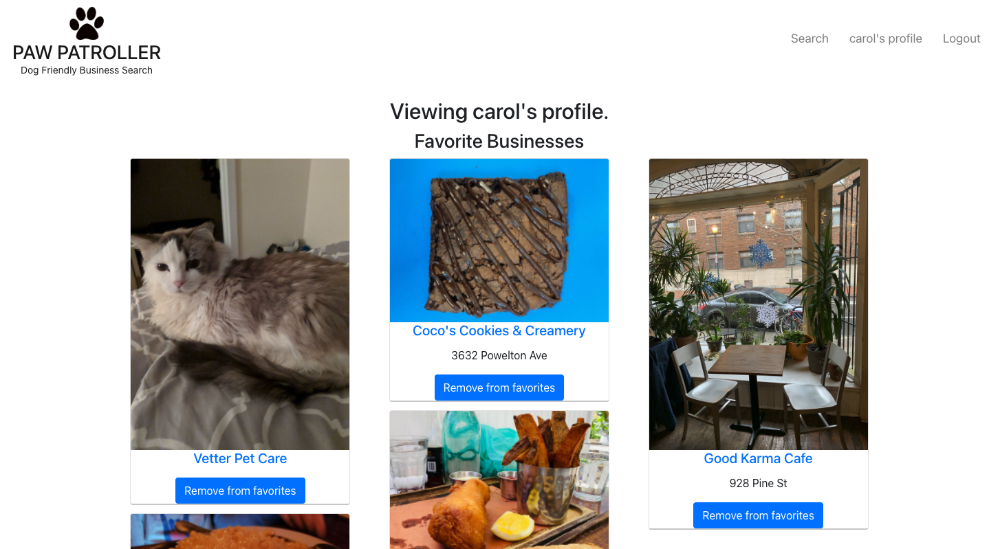

# Paw Patroller

  

  ## Description
  Dog friendly business finder

  ## Table of Contents
  - [Installation](#installation)
  - [Usage](#usage)
  - [License](#license)
  - [Contributors](#contributors)

  ## Installation
  To install dependences for this application, run the following command in terminal:

    npm install

  ## Usage

  The deployed application can be found at [this link.](https://vast-beach-07886.herokuapp.com/)

  When you arrive at the home page, you can find pet friendly businesses near you by searching for a location in the search bar. This will return a list of 20 dog friendly businesses in your location.

  

  If you want to save you favorite businesses to view later, you can sign up or login. Now when you do a search there will be an option to save a business.

  

  When you view your profile page, you can see a list of your favorite businesses. You can also click on the title of each business and that will open up the corresponding yelp page in a new tab. To remove a buisness from your favorites you can click the "remove from favorites" button.

  

  ## License
  MIT License

Copyright (c) 2022 Carol Tsai

Permission is hereby granted, free of charge, to any person obtaining a copy
of this software and associated documentation files (the "Software"), to deal
in the Software without restriction, including without limitation the rights
to use, copy, modify, merge, publish, distribute, sublicense, and/or sell
copies of the Software, and to permit persons to whom the Software is
furnished to do so, subject to the following conditions:

The above copyright notice and this permission notice shall be included in all
copies or substantial portions of the Software.

THE SOFTWARE IS PROVIDED "AS IS", WITHOUT WARRANTY OF ANY KIND, EXPRESS OR
IMPLIED, INCLUDING BUT NOT LIMITED TO THE WARRANTIES OF MERCHANTABILITY,
FITNESS FOR A PARTICULAR PURPOSE AND NONINFRINGEMENT. IN NO EVENT SHALL THE
AUTHORS OR COPYRIGHT HOLDERS BE LIABLE FOR ANY CLAIM, DAMAGES OR OTHER
LIABILITY, WHETHER IN AN ACTION OF CONTRACT, TORT OR OTHERWISE, ARISING FROM,
OUT OF OR IN CONNECTION WITH THE SOFTWARE OR THE USE OR OTHER DEALINGS IN THE
SOFTWARE.

  ## Contributors
  This project was a collaboration between the following developers:
  * [Mike Fidele](https://github.com/Mikefedele)
  * [Brandon Corporal](https://github.com/bcorporal)
  * [Carol Tsai](https://github.com/carol-tsai)

  Please contact one of the contributors to this project if you have any questions or would like to contribute to the repo.
